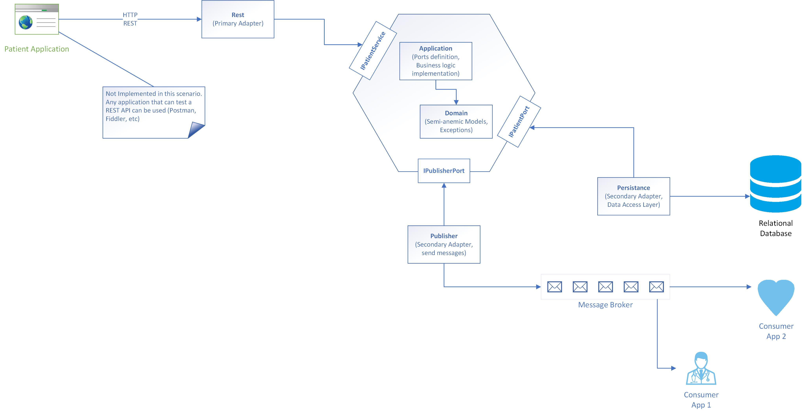
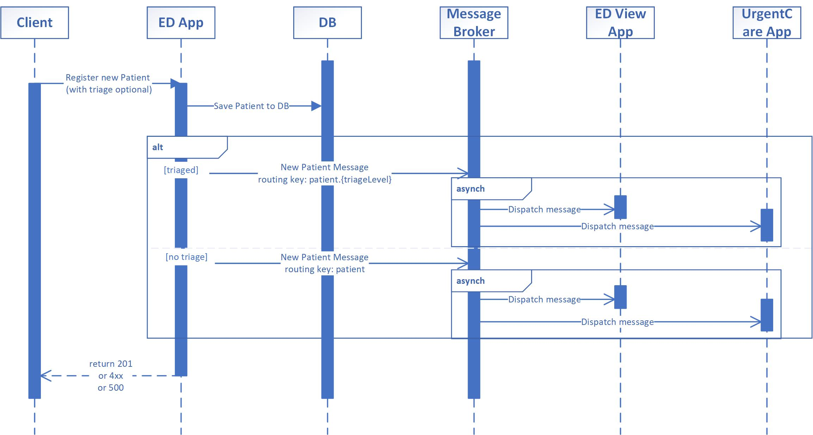
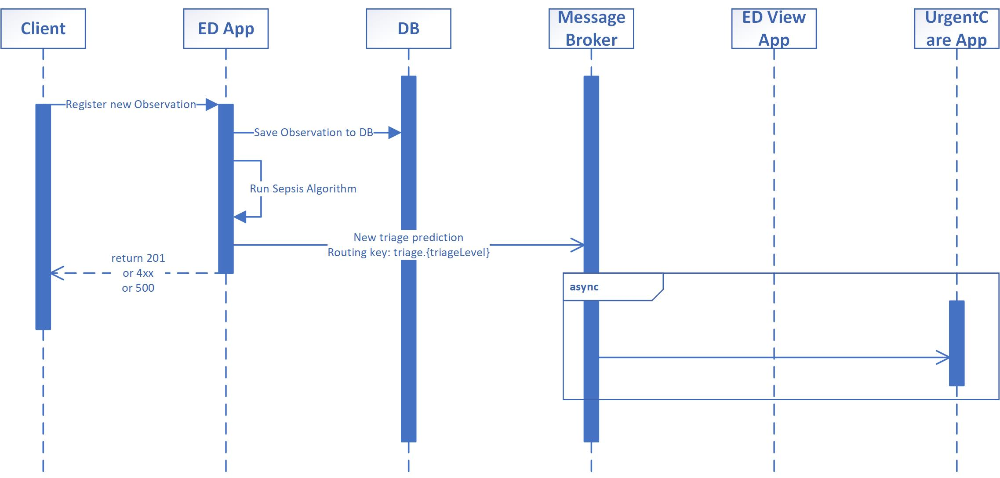
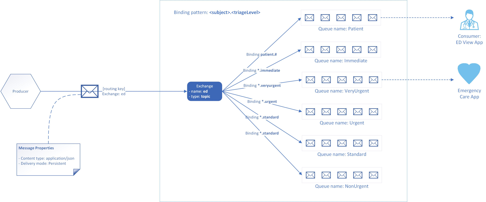
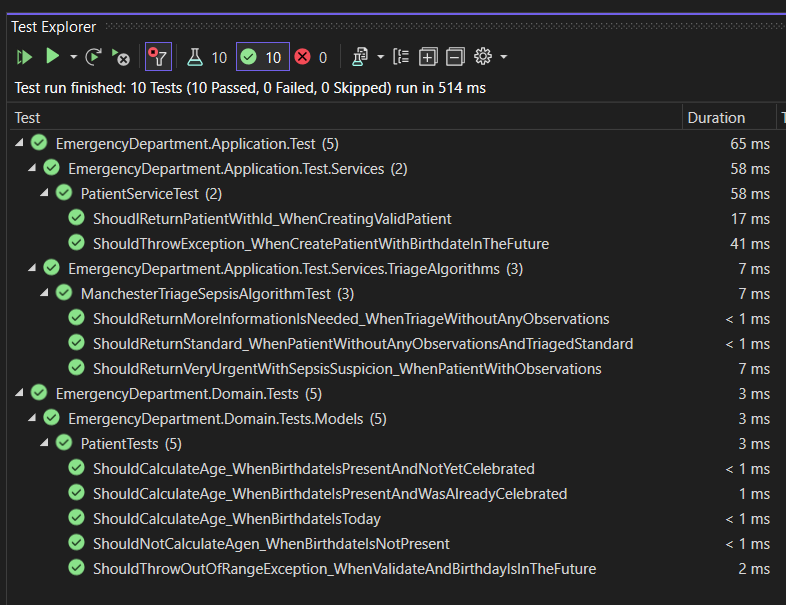

# EDPublisherSubscriber

  
Table of Contents

  <ol>
    <li><a href="#abstract">Abstract</a></li>
    <li><a href="#context">Context</a></li>
    <li><a href="#proposed-applications">Proposed Applications</a></li>
    <li>
        <a href="#architecture">Architecture</a>
        <ul>
            <li><a href="#backend">Backend</a></li>
                <ul>
                    <li><a href="#rest-api">REST API</a></li>
                </ul>
            <li><a href="#edview-app">EDView App</a></li>
            <li><a href="#urgentcare-app">UrgentCare App</a></li>
            <li>
                <a href="#diagrams">Diagrams</a>
                <ul>
                    <li><a href="#new-patients">New Patients</a></li>
                    <li><a href="#new-observations">New Observations</a></li>
                </ul>
            </li>
            <li><a href="#asynchronous-communication">Asynchronous communication</a></li>
        </ul>
    </li>
    <li>
        <a href="#build-the-solution">Build the solution</a>
        <ul>
            <li><a href="#prerequisites">Prerequisites</a></li>
            <li><a href="#unit-tests">Unit tests</a></li>
        </ul>
    </li>
    <li>
        <a href="#Run-the-solution-for-the-first-time">Run the solution for the first time</a>
        <ul>
            <li><a href="#prerequisites-1">Prerequisites</a></li>
            <li><a href="#steps">Steps</a></li>
        </ul>
    </li>
    <li><a href="#further-steps">Further Steps</a></li>
  </ol>

## Abstract
Demonstrate the concept of Publisher/Subscriber pattern.

## Context
I have chose the the a minimal subset of the processes that happen in most of the Emergency Departments, with the focus on two major scenarios.

Keep in mind that an emergency department can be seen as a miniature hospital by itself.

Furthermore, a major step that's happening in every emergency department is the triage. Each hospital can chose betwen a standard triage process or define their own custom triage process. <b>Manchester Triage</b> is a clinical risk assesment tool and management tool that defines a scale of 5 urgency levels:
<ul>
    <li>Immediate</li>
    <li>Very urgent</li>
    <li>Urgent</li>
    <li>Standard</li>
    <li>Non urgent</li>
</ul>

For this demo two scenarios have been chosen:
<ol>
    <li>It's very common to register a new patient. Imagine a patient is either brought in by the ambulance or is presents by itself to the ED. Sometimes a lot of data is known about the patient, othertimes it may be hard to identify the patient from the begning (treating John Doe). Sometimes patients can be triaged from the begining (so we may have this piece of information or not).</li>
    <li>Weather the patient has be triaged or not, whenever a new observations is recorded (blood pressure, respiration rate, or temperature) the sepsis algorithm is run and a prediction regarding the sepsis risk is made</li>
</ol>

## Proposed Applications
In order to model the workflows stated above the following applications have been considered:
<ul>
    <li>A web application exposing a REST API that enables clinicians to save new patients, and observations that are of interest for our scenario. This application will act as a Publisher since it will generate message of interst for the other applications. We can reffer to this application as the <b>Backend</b></li>
    <li>It's easy to imagine in an Emergency Department to have an application running on a wide screen displaying all patients and their latest data. For ease of implementation a <b>Console App</b> was chosen. We can call this application <b>ED View</b></li>
    <li>Based on the triage level of a patient different procedures will apply, so workflows exist based on the triage level. Imagine a CareApplication that runs optimized for clinicians working on the patients triaged as <i>Very urgent</i>. We'll reffer to this app as <b>UrgentCare App.</b></li>
</ul>

## Architecture

The entire solution (all applications) are build using .NET 7.

### Backend
Hexagon architecture is used for the backend, exposing a REST API, and data is persisted using Microsoft SQL Server.
<ul>
    <li><b>Core</b>: Is composed of two parts: the <i>domain</i> (holding semi-anemic models> and the <i>application</i> which implements business logic, and defines the interfaces (also called ports): primary (driving) and secondary (driven).</li>
    <li>Primary Adapter: the REST project will only need the interface definitions, letting the DI framework to provide the right instances. The Core is unaware of this project existing.</li>
    <li>Secondary Adapter - Persistance: will act as the data access laer, using Entity Framework to perform create & read operations. The Core is unaware of this implementation, relying only on interfaces. Microsoft SQL Server 2019 Express is used.</li>
    <li>Secondary Adapter - Pubisher: this project is responsible for interacting with the Message Broker and pushing the messages</li>
</ul>

#### REST API

| HTTP Verb | Resource URL                            | Request Payload                          | Http Response Status Code | HTTP Response                                                    |
|-----------|-----------------------------------------|------------------------------------------|---------------------------|------------------------------------------------------------------|
| POST      | /patients                               | Patient data: first name, last name, etc | 204  4xx              | No content. Header parameter: Location: /patients/{patientId} |
| GET       | /patients                               | N/A                                      | 200  404              | Patient resource                                                 |
| POST      | /patients/observations/blood-pressure   | Blood pressure data                      | 204  4xx              | No content.                                                      |
| POST      | /patients/observations/respiratory-rate | Respiratory rate data                    | 204  4xx              | No content.                                                      |
| POST      | /patients/observations/temperature      | Temperature data                         | 204  4xx              | No content.                                                      |

### EDView App
It's a simple Console Appliction that acts as a consumer (of the <i>VeryUrgent</i> queue).

### UrgentCare App
It's a simple Console Appliction that acts as a consumer (of the <i>Patient</i> queue).

### Diagrams
Bellow you can find an overview of the architecture:

The two workflows that we have identified can be transleted in the bellow sequence diagrams.

#### New Patients
A new patient is registered so besides persisting it into the database, also a message is published so any interested entity can be notified 

#### New Observations
When a new observations is measured it is persisted in the database, the Manchester Triage algorithm for sepsis is run and the output is published. 

### Asynchronous communication
A message broker is used for the Asynchronous communication. For this simple scenario RabbitMQ is proposed with the following routing topology:

## Build the solution
### Prerequisites 
* [.NET 7 SDK](https://dotnet.microsoft.com/en-us/download/dotnet/7.0)
* Visual Studio 2022 Community Edition - (it's not mandatory, but helps building the solution rather than using only command line tools)

### Unit tests
xUnit and Moq are used for supporting the unit tests projects.
Since dependency injection is used at all layers for the Backend then each individual project is easely targeted by unit tests.

## Run the solution for the first time
### Prerequisites 
* [.NET 7 SDK](https://dotnet.microsoft.com/en-us/download/dotnet/7.0 ".NET 7 download page") 
* Visual Studio 2022 Community Edition - (it's not mandatory, but helps building the solution rather than using only command line tools)
* [Microsoft SQL Server 2019 Express](https://www.microsoft.com/en-us/sql-server/sql-server-downloads "MS SQL Server page") (a localhost was used)
* [Erlang/OTP](https://www.erlang.org/downloads "Erlang download page") 
* [RabbitMQ](https://www.rabbitmq.com/download.html "RabbitMQ download page") 
* Any tool for API testing or that acts as a client (like Postman, Fiddler, cURL, etc)

### Steps
* Clone the repository
* Open the solution in Visual Studio
* Set the ConnectionString in the REST project to an instance of Microsoft SQL Server Express
* Setup RabbitMQ: define the Exchange, Queues, and Bindings as described in the [Routing Topology diagram](#Asynchronous-communication).
* Start the REST application
* Start the EDView App
* Start the UrgentCare App

Now you may be able to use Postman (or any tool of your preference) to create patients, and observations in order to trigger the Manchester Triage Sepsis Algorithm.

# Further Steps
<ol>
    <li>Implement cross-cutting concerns that were completely left out, like: authentication and authorization, logging. </li>
    <li>Improve the unit tests code coverage. </li>
    <li>Take the example even further by implementing more workflows (and complete workflows). </li>
    <li>Analyze the oportunity of intrudicing design patterns. </li>
    <li>Parameters from configuration files should be used and read as environment variables.</li>
    <li>Setup docker images for each application and publish them. (either to a local image repository or to an online image repository).</li>
    <li>Define a minimal infrastructure as a code for creating a Kubernetes deployment and either run it in a cloud or localy by using minikube. Add tools for monitoring, etc.</li>
</ol>
